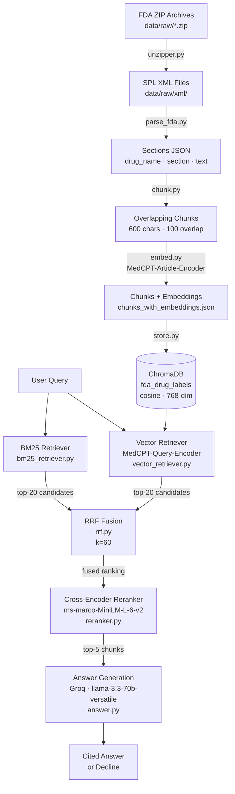

# FDA Drug Label RAG System

## Overview

This project is a Retrieval-Augmented Generation (RAG) system for querying FDA-approved drug labels. It ingests FDA Structured Product Labeling (SPL) XML files, chunks and embeds the text using a medical-domain transformer model (MedCPT), stores embeddings in a persistent ChromaDB vector store, and answers natural-language questions by combining BM25 keyword search with dense semantic retrieval, fusing the results via Reciprocal Rank Fusion, reranking with a cross-encoder, and generating cited answers through a Groq-hosted LLM. Every answer is grounded strictly in the retrieved label text — the system declines rather than hallucinating when a drug is not in the index.

---

## System Architecture



---

## Tech Stack

| Component | Technology | Why |
|---|---|---|
| **XML parsing** | `lxml` | Fast, standards-compliant HL7v3 SPL XML parsing |
| **Text splitting** | LangChain `RecursiveCharacterTextSplitter` | Paragraph → sentence → word fallback preserves semantic units |
| **Article embeddings** | `ncbi/MedCPT-Article-Encoder` (768-dim) | Trained on biomedical literature; outperforms general models on clinical text |
| **Query embeddings** | `ncbi/MedCPT-Query-Encoder` | Asymmetric encoder pair — must match article encoder for accurate retrieval |
| **Vector store** | ChromaDB (SQLite, cosine) | Persistent, zero-infrastructure, supports metadata `where` filters |
| **Keyword search** | BM25Okapi (`rank-bm25`) | Captures exact drug/dose terminology that dense search can miss |
| **Retrieval fusion** | Reciprocal Rank Fusion | Score-free merging of heterogeneous ranked lists; robust to score scale differences |
| **Reranking** | `cross-encoder/ms-marco-MiniLM-L-6-v2` | Joint query–passage scoring fixes rank errors from bi-encoder retrieval |
| **Answer generation** | Groq · `llama-3.3-70b-versatile` | Low-latency inference; strong instruction-following for citation and declination rules |
| **Evaluation** | RAGAS Faithfulness | LLM-as-judge metric: verifies every answer claim is inferable from retrieved context |
| **CI** | GitHub Actions | Automated quality gate on every PR; fails build if faithfulness drops below 0.8 |

---

## Setup

### 1. Clone the repository

```bash
git clone <repo-url>
cd "RAG project"
```

### 2. Create and activate a virtual environment

```bash
python -m venv .venv

# Windows
.venv\Scripts\activate

# macOS / Linux
source .venv/bin/activate
```

### 3. Install dependencies

```bash
pip install -r requirements.txt
```

### 4. Configure environment variables

Create a `.env` file at the project root:

```
GROQ_API_KEY=your_groq_api_key_here
```

### 5. Extract XML files from zip archives

```bash
python unzipper.py
```

This extracts FDA SPL XML files from `data/raw/*.zip` into `data/raw/xml/`.

### 6. Run the ingestion pipeline

```python
from ingestion.ingest import run_ingestion
run_ingestion()          # processes all XML files
# run_ingestion(limit=5) # limit to 5 files for a quick test
```

This parses XML → chunks text → generates MedCPT embeddings → stores in ChromaDB. Embeddings are cached to `data/processed/chunks_with_embeddings.json` so re-runs are fast.

### 7. Run a query

```python
from generation.answer import generate

result = generate("What are the contraindications for Letrozole?")

if result.get("declined"):
    print("Declined:", result["reason"])
else:
    print(result["answer"])
    print("Citations:", result["citations"])
```

`generate()` handles retrieval and reranking internally. Pass an explicit `chunks` list to use pre-computed results.

---

## Evaluation Results

Evaluated against a 67-question golden dataset spanning Letrozole, Acyclovir, Hydrocortisone, Liraglutide, and Pristiq, plus 5 out-of-corpus drugs (Metformin, Warfarin, Ozempic, Lisinopril, Amoxicillin).

| Metric | Result |
|---|---|
| **Average RAGAS faithfulness** | **0.8886** |
| **Pass threshold** | 0.80 |
| **Verdict** | PASSED ✓ |
| Total questions | 67 |
| Answered with citations | 61 |
| Correctly declined | 6 |

**Correct declines:** All 5 out-of-corpus drugs (not in the index) were declined rather than hallucinated. One in-corpus question (`pristiq_005` — mechanism of action) was also declined because the relevant section did not rank into the top-5 retrieved chunks.

**Per-drug faithfulness:**

| Drug | Questions | Avg Faithfulness |
|---|---|---|
| Letrozole | 13 | ~0.97 |
| Acyclovir | 12 | ~0.81 |
| Hydrocortisone | 10 | ~0.90 |
| Liraglutide | 13 | ~0.93 |
| Pristiq | 13 answered | ~0.88 |

---

## Continuous Integration

Every pull request to `main` and every push to `main` triggers the GitHub Actions workflow defined in `.github/workflows/rag_eval.yml`.

The workflow:
1. Checks out the repository
2. Sets up Python 3.11
3. Installs all dependencies from `requirements.txt`
4. Runs `python eval/run_eval.py` with `GROQ_API_KEY` injected from repository secrets

**The build fails if average RAGAS faithfulness drops below 0.80.** This threshold was set based on the baseline score of 0.8886 to catch meaningful regressions — prompt changes, retrieval tuning, or new drug ingestion that degrades grounding quality will surface here before merging.

To add the API key to your repository: `Settings → Secrets and variables → Actions → New repository secret → GROQ_API_KEY`.

---

## Hybrid Retrieval & Cross-Encoder Reranking

### Why hybrid retrieval?

Dense vector search (MedCPT) excels at semantic similarity — it can match "contraindicated in pregnancy" to a question phrased as "can this drug be used while pregnant?" But it struggles with exact terminology: specific dosages (`800 mg every 4 hours`), drug interaction names, and numeric thresholds can rank poorly if the embedding space compresses them.

BM25 fills the gap. It scores exact token overlap and is particularly strong on queries that contain precise medical terms, drug names, and numeric values that appear verbatim in the label text.

**Reciprocal Rank Fusion (RRF)** merges both ranked lists without requiring score normalization. Each chunk's fused score is `Σ 1/(k + rank)` across both lists (k=60, the standard constant from Cormack et al. 2009). Chunks appearing in both lists receive a strong signal; chunks appearing in only one still contribute.

The hybrid retriever fetches 20 candidates from each source (40 total before deduplication) before fusing, giving RRF a meaningful candidate pool to rerank.

### What does the cross-encoder add?

Bi-encoders (BM25 and MedCPT) score the query and each passage independently, then compare. This is fast but misses fine-grained query–passage interaction.

The cross-encoder (`cross-encoder/ms-marco-MiniLM-L-6-v2`) scores each `(query, passage)` pair jointly, attending across both simultaneously. This catches cases where a passage is topically relevant but answers a subtly different question — for example, a chunk about *pregnancy risk* ranking high for a query about *dosage in renal impairment*. The cross-encoder demotes these and promotes passages that directly address the query.

The reranker runs over the top-20 RRF results and returns the top 5, which are passed to the LLM. This two-stage design (cheap retrieval → expensive reranking over a small set) keeps latency acceptable while maximising answer precision.
